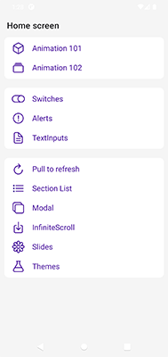
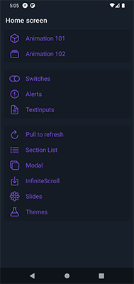

# 📱 Components App - Expo & React Native

Aplicación desarrollada con **Expo** y **React Native**, enfocada en modularidad, tipado estricto y personalización de temas.
Este proyecto integra **Nativewind**, hooks propios de Expo y componentes customizados para ofrecer una experiencia fluida en **modo Dark y Light**.

---

## 🚀 Tecnologías principales

- **Expo**: entorno rápido y confiable para desarrollo móvil.
- **React Native**: base para la construcción de interfaces nativas.
- **Nativewind**: estilos declarativos con soporte para temas y tipado.
- **Animated API**: animaciones fluidas con easings y hooks personalizados.

---

## 🎨 Estilos y Temas

- **Nativewind Styles**: configuración modular de estilos.
- **Dark & Light Mode**: paleta de colores adaptada automáticamente.
- **Colores globales**: definidos en un archivo central para consistencia.
- **Tipado estricto para iconos**: garantiza seguridad y claridad en el uso de íconos.
- **Recomendaciones para temas**: guías para extender o personalizar paletas.
- **Componentes con temas aplicados personalizados**: cada componente respeta el tema activo.

---

## 🧩 Estructura y Navegación

- **Stack Navigation** y **Tab Navigation** integrados.
- Organización modular de pantallas y componentes.
- Hooks propios de Expo para gestionar estado y permisos.

---

## 🎬 Animaciones

- **Animated API**: animaciones declarativas y controladas.
- **Easings**: transiciones suaves y configurables.
- **Custom Hooks**: reutilización de lógica de animación en distintos componentes.

---

## 🛠️ Componentes Implementados

- **Switches**: con soporte de tema.
- **TextInputs**: estilizados con Nativewind.
- **Alerts**: modulares y adaptados a tema.
- **Pull to Refresh**: integrado con FlatList/ScrollView.
- **Modals**: API de modales en Expo con estructuras personalizadas.
- **Custom FadeInImage**: carga progresiva de imágenes con animación.
- **InfiniteScroll**: listas con carga dinámica.
- **Custom ThemeChanger**: cambio de tema en tiempo real.
- **Cambiar tema usando Nativewind + Expo Hooks**: integración directa con el estado global.

---

## 💡 Recomendaciones

- Mantener **colores globales** en un solo archivo para escalabilidad.
- Usar **tipado estricto** en íconos y props para evitar errores.
- Documentar cada **hook personalizado** para onboarding futuro.
- Extender los temas con **metáforas visuales** (ej. reloj, corazón, tornillos) para guiar a nuevos colaboradores.

---

## 📸 Capturas de pantalla

| Light | Dark   |
| ----- | ------ |
|  |  |

## ⚙️ Instalación y ejecución

1. Clonar repositorio

```bash
git clone https://github.com/Charly7879/components-expo-react-native
```

2. Instalar dependencias

```bash
npm install
```

3. Ejecutar proyecto

```bash
npx expo start
```

---

## 👨‍💻 Autor

Carlos Ceballez  
*Técnico Superior en Programación - UTN*  
[linkedin.com/in/carlos-ceballez/](https://linkedin.com/in/carlos-ceballez/)  
